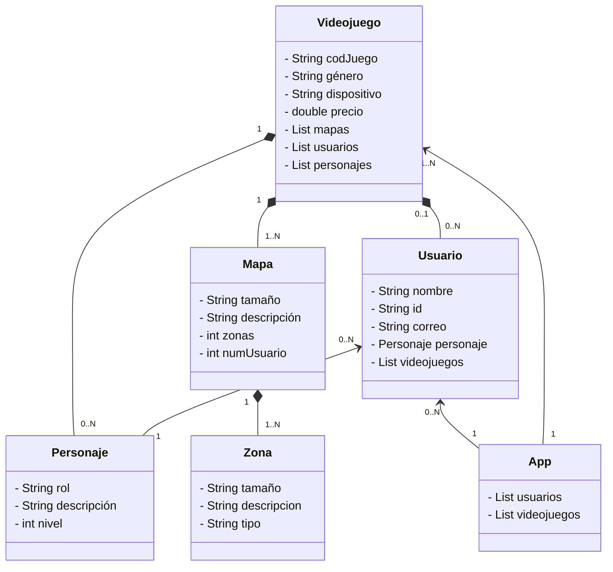

# Videojuego (Proyecto Maven)

**Videojuego** es una aplicación de ejemplo escrita en Java que modela un sistema de videojuegos con usuarios, personajes, mapas y zonas. Este proyecto está orientado a mostrar un diseño basado en un modelo de dominio bien definido y cuenta con una capa de pruebas unitarias.

---

## 🧩 Visión general

El sistema permite la gestión de los siguientes conceptos:

- **Usuario**: representa un jugador que puede tener personajes y acceder a videojuegos.
- **Personaje**: un avatar dentro del juego con rol, nivel y descripción.
- **Videojuego**: contiene información como género, dispositivo y precio; y gestiona mapas, personajes y usuarios.
- **Mapa**: un entorno del videojuego compuesto por varias zonas.
- **Zona**: subáreas dentro de un mapa con tipo y descripción.

---

## 🚀 Requisitos

- **Java 21** (u otra versión compatible con `maven.compiler.source/target` en `pom.xml`)
- **Maven 3.8+**

---

## 🛠️ Cómo compilar y ejecutar

### 1) Compilar

```bash
mvn clean compile
```

### 2) Ejecutar pruebas

```bash
mvn test
```

### 3) Empaquetar

```bash
mvn package
```

### 4) Ejecutar la aplicación

Después de `mvn package` se generará un JAR en `target/`:

```bash
java -jar target/videojuego-1.0-SNAPSHOT.jar
```

---

## 🗂️ Estructura del proyecto

```
src/main/java/org/palomafp/videojuego/      # código fuente
src/test/java/org/palomafp/videojuego/      # pruebas unitarias (JUnit 5)
doc/digrama_de_clases.md                    # diagrama de clases en Mermaid
```

---

## 🧭 Diagrama de clases (Mermaid)

El siguiente diagrama muestra el modelo de dominio central del proyecto.



---

## 🧪 Pruebas

Las pruebas unitarias se encuentran en `src/test/java/org/palomafp/videojuego/` y usan **JUnit 5**.

```bash
mvn test
```

---

## 📌 Notas

- El proyecto se configura mediante Maven y no tiene dependencias externas fuera de JUnit.
- El punto de entrada principal es `org.palomafp.videojuego.App`.
